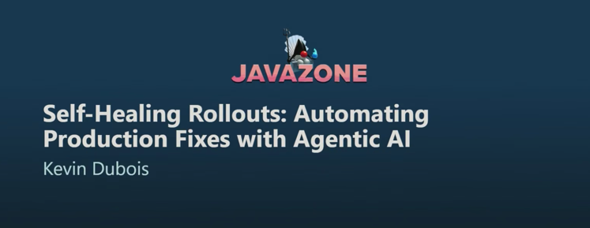

### Ship it, but not to everyone at once

- Default deploy: big bang, all or nothing
- One bad release, all users feel it
- Progressive delivery: roll out gradually instead

Notes:

- Talk by Kevin Dubois (IBM), JavaZone: "Self-Healing Rollouts"
- Opens with a real outage story, a bad release pushed to 100% of users at once
- Sets up the rest of the talk: what if the rollout itself could catch that and react

---

### GitOps, the foundation

<!-- .element: class="kc-smaller" -->

Notes:

- Git is the single source of truth, for source code and for cluster config
- Argo CD continuously reconciles: deploy, monitor, detect drift, take action
- This loop is what canary rollouts and automated rollback plug into

---

### Canary rollout, step by step

<!-- .element: class="kc-smaller" -->

- `git push` triggers Argo Rollouts
- Raise the canary weight a bit at a time
- Check metrics after every step, before raising further

Notes:

- Argo Rollouts is the Kubernetes controller doing the gradual traffic shift
- Alternatives exist too, e.g. Flagger
- Each step queries a metric (originally hand-written PromQL) against a threshold
- All steps pass, promote to stable, any step fails, abort and roll back

---

### Where AI comes in

- Hand-written PromQL thresholds are brittle
- Replace the metric check with an AI analysis step
- Same loop, smarter judgment call

<!-- .element: class="kc-smaller" -->

Notes:

- "Write custom PromQL" vs "use AI to analyze failures", the talk's own framing
- The AI looks at logs and metrics together, not just one threshold
- Failure path already opens a rollback, before a human even looks at a screen

---

### Under the hood, an agent pipeline

<!-- .element: class="kc-smallest" -->

<!-- .slide: class="is-empty" -->

Notes:

- Trigger: Argo Rollouts calls a metric plugin during the canary step
- Parallel data collection: separate agents pull logs, error rates, latency, memory
- Analysis loop: one agent analyzes, another scores the analysis, retries if low quality
- Response: promote or rollback decision, returned synchronously so the rollout isn't blocked
- Async remediation, branches on root cause: a code bug gets a generated patch and a PR, an operational issue gets a GitHub issue instead

---

### Takeaways

- Rolling out to everyone at once is risky
- Canary rollouts make bad releases cheap to catch
- AI can read the metrics and logs for you
- GitOps ties it together: promote or roll back, automatically

Notes:

- These are the talk's own closing takeaways
- Emphasize: this isn't AI replacing the rollout strategy, it's AI replacing the manual "is this metric OK" judgment call inside it

---

### Like it? See...

<!-- .slide: class="is-fancy1" -->
