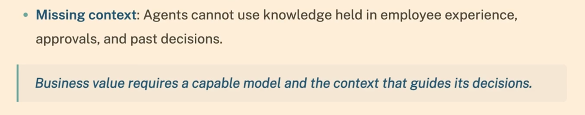
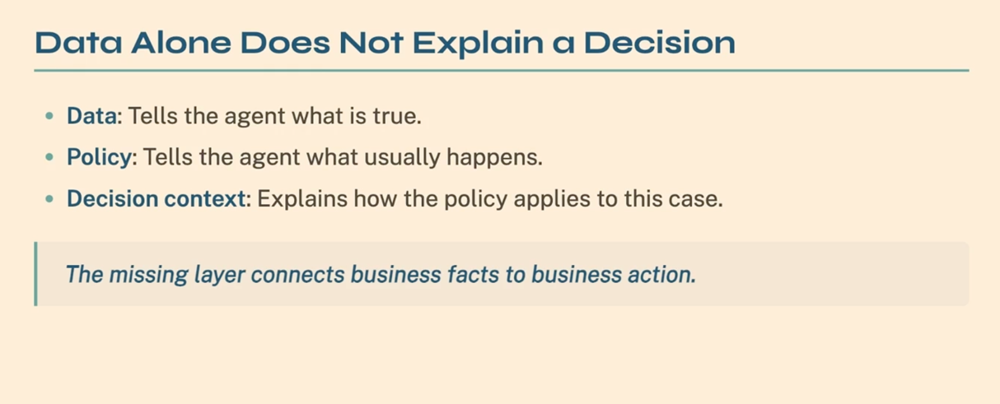
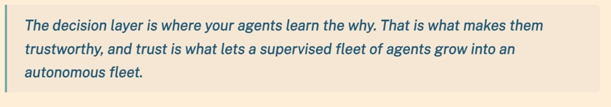
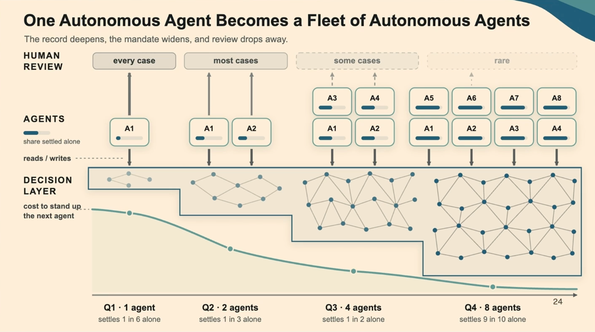
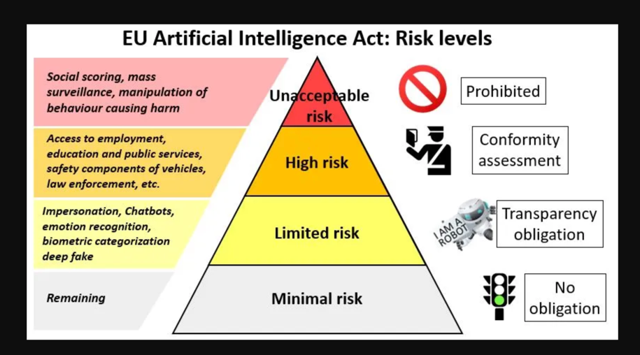

### The problem

> How to include business processes and decisions in AI agents?

<!-- .element: class="fragment" -->

- <!-- .element: class="fragment" -->
  Multi-agent systems share data, not reasoning

---

### The problem

- Enables processing business processes and decisions (the why) by AI agents.

---

### The solution

Create a persistent decision layer.

- <!-- .element: class="fragment" -->
  Decision Layer
  - a Spring AI Advisor that persists every query's decision trace to Neo4j
- <!-- .element: class="fragment" -->
  Graph traversal beats vector search
  - it follows *why* a decision applies, not just what looks similar
- <!-- .element: class="fragment" -->
  Result 
  - agents share the reasoning behind every prior decision, not just the data

---

### What scared me...

---

### What about the EU AI Act?

---

### Take away

> Use a decision layer to include the **"why?"** in the context of AI agents.

---

### Like it? See...

<!-- .slide: class="is-fancy1" -->
