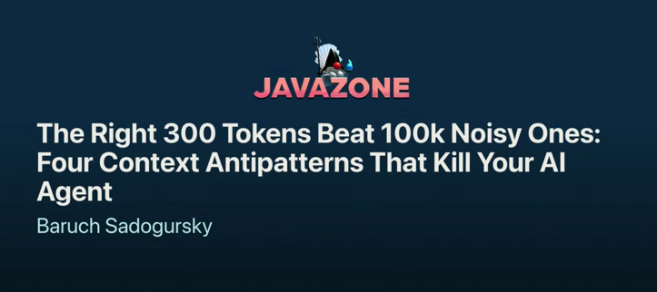

### From prompting to context

- Prompt engineering: craft the perfect instruction
- Context engineering: design what the model sees
  - ... **and what it never sees**
    - Size matters: more is not better

---

### Four antipatterns

**The Stuffed Prompt 🥙** \
Everything crammed upfront, static context does not scale
<!-- .element: class="pos-color3 fragment" -->

**The Wrong Tool 🪓** \
One retrieval method used everywhere
<!-- .element: class="pos-color1 fragment" -->

**The Goldfish Agent 🐟** \
Forgets everything between sessions.
<!-- .element: class="pos-color2 fragment" -->

**The Vibes Eval 😎** \
Shipped because it felt right
<!-- .element: class="pos-color4 fragment" -->

---

### The fixes

| Antipattern    | Fix                                                                             |
|----------------|---------------------------------------------------------------------------------|
| Stuffed Prompt | Lazy-load on demand via skills.                                                 |
| Wrong Tool     | Right tool.                                                                     |
| Goldfish Agent | External memory you control.   Versioned, backed up, portable across agents. |
| Vibes Eval     | LLM writes rubrics, you review, LLM judges.                                     |

<!-- .element: class="kc-table kc-left" -->

Notes:

- Built-in memory: no versioning, no backup, no portability
- Eval pitfalls: bleeding, leaking, negative scenarios
- You assess the delta, not the vibe

---

#### Wrong tool, right tool

| You need    | Wrong                  | Right          |
|-------------|------------------------|----------------|
| Correctness | Similarity search, RAG | Versioned docs |
| Process     | Static docs (Context7) | Skills         |
| Determinism | LLM reasoning          | Scripts        |
| Judgment    | Scripts, regex         | Reasoning      |

<!-- .element: class="kc-table kc-smaller kc-left" -->

Notes:

- RAG returns topically similar, version blind
- Context7-style docs give reference, not how-to
- LLM re-derives the same math every turn, slightly differently
- The regex trap: open-ended input, brittle code

---

### Ship the context 🚀

**Docs + Skills + Scripts + Rules**

Versioned. Tested. Distributed.

- Context becomes an artifact, like a jar
- Same rigor as code: review it, test it, release it

---

### Takeaway

> Stop tuning prompts, start shipping context.

---

### Like it? See...

<!-- .slide: class="is-fancy1" -->
